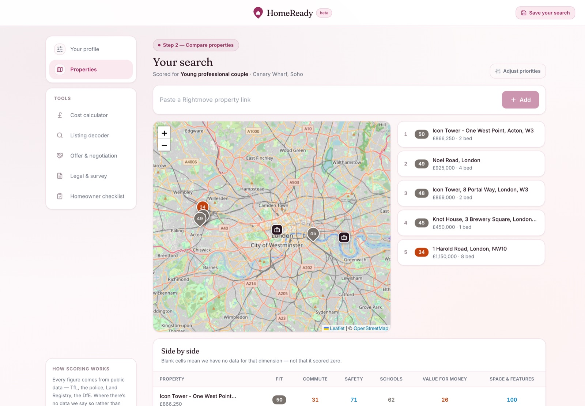
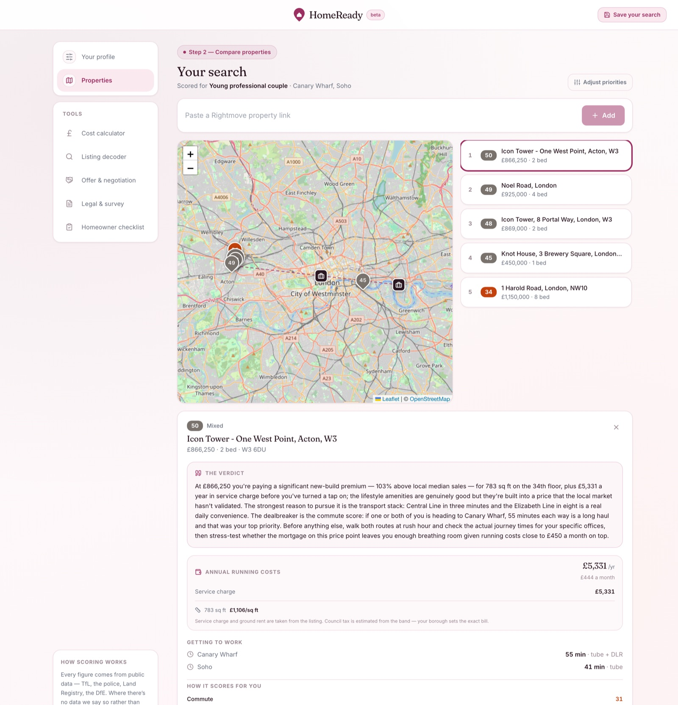

# HomeReady

**Buying your first home in London is a research project nobody trained you for.**

[**Try it →** homeready-pied.vercel.app](https://homeready-pied.vercel.app)



You have nine Rightmove tabs open. One flat is £40,000 cheaper than another and
you genuinely cannot tell whether that is a bargain or a warning. The listing
says *"moments from the station"* — which station, and how long does that
actually take to your office on a Tuesday morning? The service charge isn't
mentioned. Neither is the council tax band. You started a spreadsheet three
weekends ago and you've already lost track of which places you liked and why.

And underneath all of it:

- **The asking price tells you nothing.** Whether £550,000 is fair depends on
  what the flats around it actually sold for — which isn't on the listing.
- **The price is not the cost.** Stamp duty, service charge, ground rent,
  council tax. A cheaper flat carrying a £5,000 annual service charge is the
  more expensive purchase, and most people find that out far too late.
- **Listings are written to sell.** "Deceptively spacious", "well presented",
  "would suit an investor" — every phrase is doing work, and none of it for you.
- **"It's a good area" is useless advice.** Good for whom? A 25-minute commute
  is everything to one buyer and irrelevant to another.
- **Nobody in the room works for you.** The estate agent works for the seller.
- **You can't hold it in your head.** Eight properties across six dimensions is
  forty-eight moving facts, and it changes every time a new listing lands.

So you end up making the largest financial decision of your life at speed, in
competition with other buyers, on information chosen by the person selling to you.

---

## What HomeReady does

Tell it who you are and what actually matters to you. Then paste property links
as you find them. Each one lands on a map of London with a real door-to-door
commute time to your workplace, recorded crime in the area, what neighbours
actually paid, what the place costs every year to own — and a score built from
*your* priorities, not someone else's.

It won't tell you a property is good. It will tell you what it is, what it will
cost you, and where it falls short of what you asked for — including, plainly,
the things it doesn't know.

**There is no universal "good area".** A flat that suits a couple optimising a
commute is often wrong for a family optimising schools and space. So HomeReady
never gives a property one objective rating. It rates it for you, and shows you
the weights behind the number so you can argue with them.

> **Scope:** London only for now. Door-to-door journey times come from TfL,
> which doesn't cover the rest of the UK.

---

## How it works

**1 — Describe what you're looking for.** Pick one of four starting profiles and
adjust it: your budget and deposit, minimum bedrooms, whether you need outdoor
space or parking, and where you need to commute to. Add a workplace for each
person, each with its own acceptable journey time. Then set how much you care
about commute, safety, schools, value and space.


**2 — Paste property links.** Each one is scraped, enriched from public data and
scored in about two seconds. Pins are coloured by fit and carry the score.
Your workplaces show as separate markers. Click any property for the full
breakdown, a plain-English verdict, and its annual running costs — or compare
everything side by side in one table.



**3 — Use the tools when you need them.** A stamp duty and fees calculator, a
listing decoder that translates estate agent language, an offer and negotiation
planner, a conveyancing document explainer, a survey interpreter, and a
post-completion checklist.

---

## How the fit score works

Each property is scored 0–100 on five dimensions, then combined using the
weights from your profile:

| Dimension | What it measures |
|---|---|
| **Commute** | Door-to-door journey time to each of your workplaces, scored on the worst one |
| **Safety** | Recorded street-level crime within roughly a mile |
| **Schools** | Primary and secondary provision within 1.5 km, and how close the nearest is |
| **Value** | Asking price against recent local sales, adjusted for annual running costs |
| **Space** | How the property matches the requirements you stated |

**A dimension with no data leaves the calculation entirely.** It is never
imputed as a middling 50, and never as 0 — the remaining weights renormalise and
you are told what share of your priorities the score actually rests on. A
property showing *"Fit 74 · based on 80% of your priorities"* is missing
something, and the missing dimension says why.

This matters more than it sounds. Filling a gap with a default would let a
property we know nothing about outrank one we know is poor.

---

## Where the numbers come from

Everything is computed from public data. Claude is used for language — reading
listing prose and writing the verdict — and never to calculate, sum, or recall a
figure.

| Source | Provides | Key required |
|---|---|---|
| [postcodes.io](https://postcodes.io) | Coordinates, grid references, statistical areas | No |
| [TfL Unified API](https://api.tfl.gov.uk) | Door-to-door journeys, nearest stations | No |
| [data.police.uk](https://data.police.uk) | Street-level crime by category | No |
| [HM Land Registry Price Paid](https://landregistry.data.gov.uk) | Recent sold prices | No |
| [DfE Get Information About Schools](https://get-information-schools.service.gov.uk) | School locations and phases | No |
| Rightmove listing page | Price, tenure, floor area, service charge, council tax band | No |
| [Anthropic API](https://console.anthropic.com) | Listing interpretation, written verdicts | **Yes** |

Statutory figures — Stamp Duty Land Tax and HM Land Registry fees — come from
rate tables in [`backend/app/services/calculators.py`](backend/app/services/calculators.py),
with the effective date returned in the API response. Where a cost is an
estimate rather than a published rate, the interface says so.

Two known gaps, stated rather than papered over: **Ofsted ratings** are not
available, so the schools score reflects provision and proximity but not
quality; and **flood risk** is not covered at all, because no dependable
property-level source was found.

---

## Tech stack

| Layer | Technology |
|---|---|
| Frontend | React 18 + Vite + TypeScript + Tailwind CSS |
| Map | Leaflet + OpenStreetMap |
| Backend | FastAPI + async SQLAlchemy + asyncpg |
| Database | PostgreSQL |
| AI | Anthropic Claude (`claude-sonnet-4-6`) |
| Auth | Supabase Auth (optional in local development) |
| Migrations | Alembic |
| Deployment | Vercel (frontend) · Railway (backend) |

---

## Project structure

```
homeready/
├── backend/
│   ├── main.py                       # FastAPI entry point
│   ├── app/
│   │   ├── api/routes/
│   │   │   ├── search.py             # Persona, geocoding, property assessment
│   │   │   ├── features.py           # Calculator, decoder, legal, offer
│   │   │   └── checklist.py
│   │   ├── core/
│   │   │   ├── signals.py            # Signal envelope — every lookup returns one
│   │   │   ├── claude.py             # Anthropic client, retries, timeouts
│   │   │   └── auth.py, config.py, database.py
│   │   ├── services/
│   │   │   ├── providers/            # One module per external data source
│   │   │   ├── enrichment.py         # Concurrent fan-out over the providers
│   │   │   ├── scoring.py            # Dimension scores and weighted combination
│   │   │   ├── personas.py           # Presets and dimension definitions
│   │   │   ├── calculators.py        # SDLT and fee rate tables
│   │   │   ├── running_costs.py      # Service charge, ground rent, council tax
│   │   │   ├── features_match.py     # Requirements matching, three-state
│   │   │   └── rightmove.py          # Listing parser
│   │   ├── models/                   # SQLAlchemy models + Pydantic schemas
│   │   └── prompts/                  # Claude prompt builders
│   ├── scripts/load_schools.py       # Loads the DfE schools dataset
│   ├── migrations/                   # Alembic
│   └── tests/
└── frontend/
    └── src/
        ├── pages/
        │   ├── PersonaPage.tsx       # Profile and priorities
        │   ├── MapPage.tsx           # Map, ranking, comparison
        │   └── …                     # Calculator, decoder, legal, offer, checklist
        ├── lib/
        │   ├── api.ts                # API client
        │   └── fit.ts                # Client-side scoring mirror for live re-ranking
        ├── components/ui/            # Shared design system
        └── types/
```

---

## Development

Setup, tests and deployment are in
[`docs/development.md`](docs/development.md).

---

## A note on the listing parser

Property details are read from Rightmove listing pages. Automated extraction
sits against Rightmove's terms of use, so this is suitable for personal research
but should be replaced with a licensed data feed before any public deployment.
